# RegelRecht Upload Portal - Architecture

Dit document beschrijft de technische architectuur van het RegelRecht Upload Portal.

## Inhoudsopgave

1. [Systeem Overzicht](#systeem-overzicht)
2. [Component Architectuur](#component-architectuur)
3. [Database Schema](#database-schema)
4. [API Routes](#api-routes)
5. [Authentication Flows](#authentication-flows)
6. [Submission Workflow](#submission-workflow)
7. [File Upload Flow](#file-upload-flow)
8. [Directory Structuur](#directory-structuur)

---

## Systeem Overzicht


---

## Component Architectuur


---

## Database Schema


### Enumeraties


---

## API Routes


---

## Authentication Flows

### Admin Login Flow


### Uploader Self-Service Login


### Session Validation


---

## Submission Workflow

### Applicant Journey


### Document Upload Flow


---

## File Upload Flow

```mermaid
flowchart TD
    A[Upload Request] --> B{Submission<br/>Exists?}
    B -->|No| C[404 Not Found]
    B -->|Yes| D{Status Check}

    D -->|Draft| E[Allow Upload]
    D -->|Submitted| F{Has Uploader<br/>Session?}
    D -->|Other| G[403 Forbidden]

    F -->|Yes| E
    F -->|No| G

    E --> H{File Size<br/>≤ 50MB?}
    H -->|No| I[400 Too Large]
    H -->|Yes| J{Valid MIME<br/>Type?}

    J -->|No| K[400 Invalid Type]
    J -->|Yes| L{Classification?}

    L -->|Restricted| M[400 Not Allowed]
    L -->|Public/Claude| N[Generate Filename]

    N --> O[Write to /data/:id/:uuid]
    O --> P[Insert DB Record]
    P --> Q[Log Audit Event]
    Q --> R[201 Created]
```



### File Storage Structure


---

## Directory Structuur


---

## Deployment Architecture

```mermaid
graph TB
    subgraph "Container Runtime"
        subgraph "App Container"
            EP[entrypoint.sh]
            APP[regelrecht-upload binary]
            FE[/app/frontend/]
        end

        subgraph "Volumes"
            DATA[/data - uploads]
        end
    end

    subgraph "External Services"
        PG[(PostgreSQL 16)]
    end

    subgraph "CI/CD"
        GHA[GitHub Actions]
        GHCR[GitHub Container Registry]
    end

    EP --> APP
    APP --> FE
    APP --> DATA
    APP --> PG

    GHA --> GHCR
    GHCR --> APP
```

### Container Build Process


---

## Security Architecture


---

## Environment Configuration


---

## Periodic Tasks


---

## Tech Stack Summary

| Layer | Technology |
|-------|------------|
| **Backend** | Rust 1.85, Axum, Tokio |
| **Database** | PostgreSQL 16+ |
| **Auth** | Argon2, SHA256, Secure Cookies |
| **Frontend** | HTML5, Vanilla JS, Web Components |
| **Styling** | RijksOverheid Design System |
| **Container** | Podman/Docker, Multi-stage build |
| **CI/CD** | GitHub Actions, GHCR |

---

*Generated: 2024 | RegelRecht Upload Portal v1.0*
